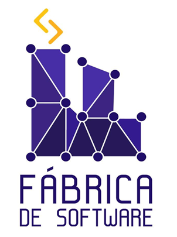

    </img>

    <h1 text-align='center'>Ciência de Dados - 2025.02 - 📈</h1>

    
Repositório utilizada para ministrar uma aula introdutório sobre Machine Learning no Workshop de Dados.

### Materiais da Aula:

1. Workflow de um projeto para problemas de Regressão; <a href="notebooks/regressao.ipynb">Clique aqui</a>

2. Workflow de um projeto para problemas de Classificação; <a href="notebooks/classificacao.ipynb">Clique aqui</a>

3. Exercício; <a href="exercicio/Exercicio.md">Clique aqui</a>

4. Slides; <a href="https://gamma.app/docs/Introducao-a-Machine-Learning-com-Python-9m392hxrzaa62qc">Clique aqui</a>

### Materiais para Estudo:

Curso na Udemy **(Pago)** - Machine Learning e Data Science com Python de A a Z: <a href="https://www.udemy.com/share/101sO83@CTwZ7GsupE_giZm8Pgz09GiOMSnD2ksySY82p_5Sw73L0yjHA4Wl72NTe2a8UTKdkg==/">Clique aqui</a>

Curso na Udemy **(Pago)** - Formação Cientista de Dados: O Curso Completo - 2025: <a href="https://www.udemy.com/share/101Xys3@kjSBdYF7XO1U5XLGXG7vf2D9bEcbyxBNCY6KLikwD8wX7vXLOMU6M9SkqhTOhu5jiA==/">Clique aqui</a>

Bootcamp na DIO **(Gratuito)** - Santander 2025 - Ciência de Dados com Python: <a href="https://www.datascienceacademy.com.br/cursosgratuitos?msg=not-logged-in">Clique aqui</a>

Data Science Academy **(Gratuito)** - Cursos Gratuitos : <a href="https://www.datascienceacademy.com.br/cursosgratuitos?msg=not-logged-in">Clique aqui</a>
